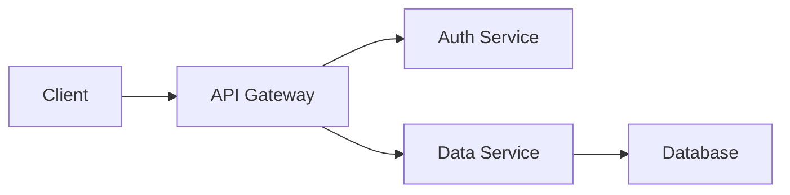

<!-- Custom theme definition -->

# Product Documentation Overview

- Email: **23f2005664@ds.study.iitm.ac.in**
- Maintainable in version control
- Convertible to PDF, HTML, PPTX via Marp CLI

---

<!-- Slide with background image -->
<!-- Use an online image URL; you can replace it with a local asset later -->
backgroundImage: url('https://images.unsplash.com/photo-1519389950473-47ba0277781c?fit=crop&w=1200&q=80')

# Feature Highlights

- Real‑time collaboration
- Integrated code samples
- Automated changelog generation

---

# Architecture Diagram

---

# Algorithmic Complexity

The time complexity of the indexing algorithm is:

$$
T(n) = O(n \log n)
$$

where *n* is the number of documents.

---

# Custom Styling Example

<!-- Use Marp directives for custom class -->
class: center, highlight

**Key Takeaway:**

> *Maintainability is achieved through modular markdown sections and version‑controlled assets.*

---

# Thank You

Contact: [23f2005664@ds.study.iitm.ac.in](mailto:23f2005664@ds.study.iitm.ac.in)

---
